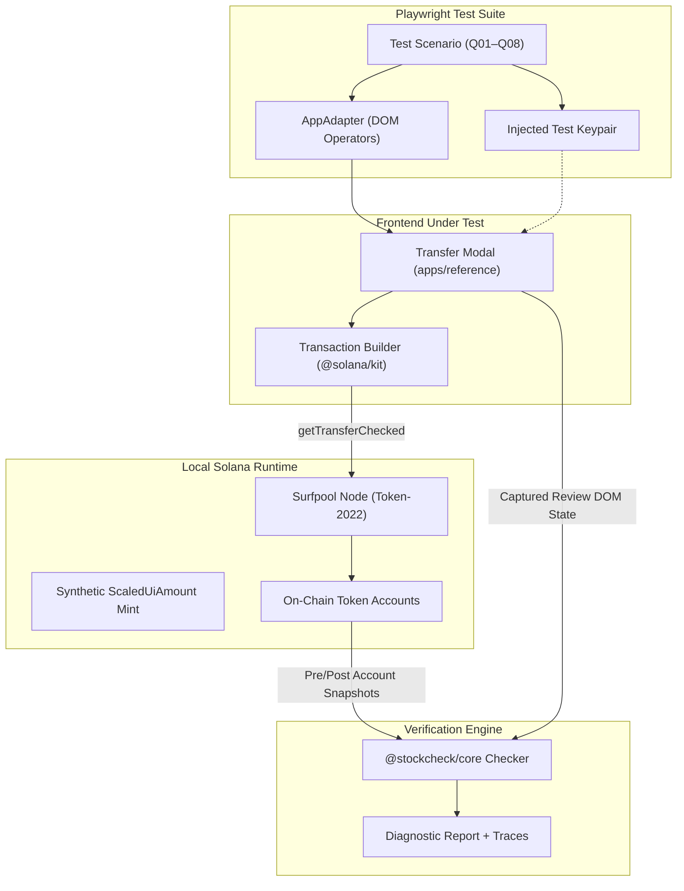

# StockCheck 

[](https://spl.solana.com/token-2022)
[](https://www.colosseum.org/)
[](https://opensource.org/licenses/MIT)
[]()

> **The Automated Regression-Testing Framework for Solana Token-2022 `ScaledUiAmount` Multipliers and Wallet Transfer Precision.**

StockCheck executes real end-to-end browser interactions against a local Solana cluster (`@solana/surfpool`) and performs independent mathematical audits comparing **what the user approved in the UI** with **what the application's transaction actually debited on-chain**.

---

## ⚡ The Problem

Solana's **Token-2022** program introduces the `ScaledUiAmountConfig` extension, allowing mints to programmatically scale user balances over time (for stock splits, interest accrual, or rebasing).

When interacting with scaled mints, wallet and dApp transfer interfaces frequently introduce catastrophic regressions:

1. **Old Multiplier Retention**: An interface shows a new multiplied balance to the user, but uses an outdated multiplier when constructing the raw transfer instruction—transferring double or half the intended tokens.
2. **Lossy Max Reconstruction**: Clicking "Max" formats the balance to a human-readable float string (e.g. `3.45` from `3.456789`), then converts that string back to raw units when building the transaction—leaving residual dust in the account and breaking full-balance sweeps.
3. **Stale Activation Multipliers**: If a scheduled multiplier transition occurs while a user has a transfer modal open, the interface fails to update its math dynamically, creating an on-chain transfer discrepancy.

**StockCheck prevents these failures before they ever hit mainnet.**

---

## 🏗️ Architecture & Core Invariant



> ⚠️ **The Non-Negotiable Invariant:**
> The checker **never** builds, dictates, or alters the application's transfer logic. The application constructs its own transaction. StockCheck acts strictly as an external, independent auditor inspecting what the UI showed versus what the Solana ledger executed.

---

## 🚀 Quick Start: Single-Command Demo

StockCheck includes an automated end-to-end runner that exercises all unit tests, on-chain E2E scenarios, and seeded defect specimens in sequence:

```bash
# 1. Start the local Solana cluster
surfpool start --offline --no-tui --no-studio

# 2. Run the complete automated demo
pnpm demo
```

### Verification Scorecard

When you run `pnpm demo`, StockCheck executes 3 distinct verification phases:

```
===========================================================================
  ID    SCENARIO DESCRIPTION                        RESULT       DEFECT TRAP
---------------------------------------------------------------------------
  Q01   Multiplier=1 Baseline (2 scaled → 2,000,000) PASS         None (Correct)
  Q02   Multiplier=2 Active   (2 scaled → 1,000,000) PASS         None (Correct)
  Q03   Scheduled 1→2 Activation Time-Travel        PASS         None (Correct)
  Q04   Max Full-Balance Transfer (Zero Residual)    PASS         None (Correct)
  Q05   Explicit Unscaled Mode (2 unscaled)          PASS         None (Correct)
  Q06   Faulty App: Ignores Activation Multiplier    DETECTED     DISPLAYED_QUANTITY_MISMATCH
  Q07   Faulty App: Rounded Max Precision Loss       DETECTED     DISPLAYED_QUANTITY_MISMATCH
  Q08   Offline Runtime Check                        NOT_TESTED   Graceful Skip (Expected)
===========================================================================
```

---

## 📋 Required Test Scenarios (Brief §10)

| ID | Description | Expected On-Chain Behavior | Verified Result |
| :--- | :--- | :--- | :--- |
| **Q01** | Multiplier 1 Baseline (enter 2 scaled) | Debits `2,000,000` raw units (6 decimals) | **PASS** |
| **Q02** | Active Multiplier 2 (enter 2 scaled) | Debits `1,000,000` raw units | **PASS** |
| **Q03** | Scheduled 1→2 Activation Time-Travel | Coordinates chain clock + virtual browser timers across boundary | **PASS** |
| **Q04** | Max Full-Balance Transfer | Sweeps entire source balance with zero residual tokens | **PASS** |
| **Q05** | Explicit Unscaled Mode | Ignores multiplier; transfers `2,000,000` raw units | **PASS** |
| **Q06** | Seeded Defect: Old-Multiplier Retention | Traps faulty app transferring `2,000,000` instead of `1,000,000` | **FAIL (Detected)** |
| **Q07** | Seeded Defect: Max Float Rounding Loss | Traps residual raw tokens left behind by rounded input | **FAIL (Detected)** |
| **Q08** | Missing Runtime / RPC Unreachable | Returns `NOT_TESTED` or graceful skip (never a false PASS) | **NOT_TESTED** |

---

## 📦 Monorepo Organization

```
stockcheck/
├── apps/
│   └── reference/              # Reference transfer application (React + Vite + @solana/kit)
├── packages/
│   ├── core/                   # Pure audit engine (math precision, verdict evaluation, reports)
│   ├── playwright/             # AppAdapter interface, fixtures, and scenario runner
│   ├── runtime/                # Surfpool wrapper, clock coordination, ATA balance queries
│   └── test-wallet/            # Ephemeral keypair generation and browser injection
├── adapters/
│   └── reference/              # Production adapter implementation for apps/reference
├── fixtures/
│   └── synthetic/              # Pinned Token-2022 mint state & SHA-256 byte tracking
├── scripts/
│   ├── create-mint.mjs         # Pure @solana/kit on-chain synthetic mint generator
│   └── demo.mjs                # Single-command executive demonstration runner
├── tests/
│   ├── unit/                   # 19 core math & multiplier resolution unit tests
│   ├── e2e/                    # Playwright E2E scenarios Q01–Q08
│   └── specimens/              # Seeded defect assertion suite (Q06 & Q07)
└── docs/
    ├── ARCHITECTURE.md         # Deep-dive system architecture & invariants
    └── ADAPTER_GUIDE.md        # Guide for integrating third-party Solana wallets
```

---

## 🔌 Integrating Third-Party Wallets

StockCheck was designed to audit any wallet or dApp. Implementing the `AppAdapter` interface requires fewer than 30 lines of code.

See [`docs/ADAPTER_GUIDE.md`](docs/ADAPTER_GUIDE.md) for step-by-step instructions.

---

## 🧪 Running Individual Test Suites

```bash
# Run core math and serialization unit tests
pnpm test:unit

# Run full on-chain E2E browser tests
pnpm test:e2e

# Run seeded defect specimens
pnpm test:specimens

# Open the interactive Playwright test report
pnpm report
```

---

## 📜 Third-Party Notices & Safety

All test tokens, accounts, and transactions in StockCheck exist purely within the local Surfpool test environment. No real mainnet funds are ever utilized or risked.

See [`THIRD_PARTY_NOTICES.md`](THIRD_PARTY_NOTICES.md) for open-source component disclosures.

---

## 📄 License

MIT License. Developed for the **Colosseum Solana Hackathon (2026)**.
